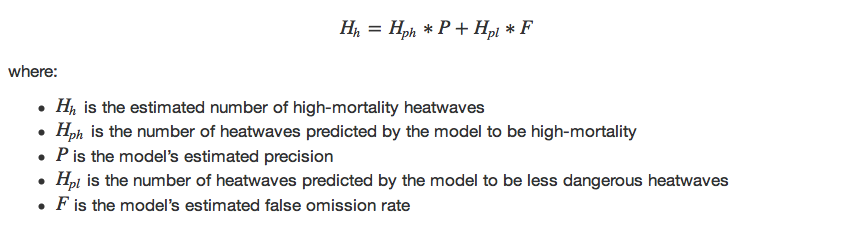
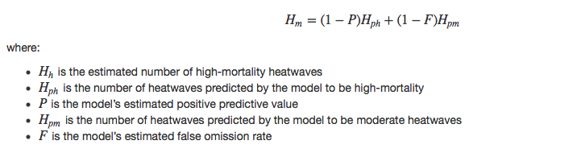
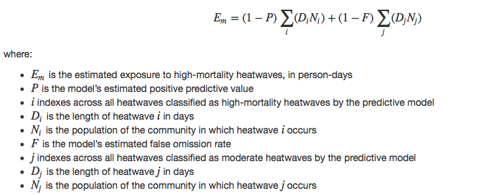

Overview
========

We have developed several predictive models to classify whether a
heatwave is high-mortality, which we define as a heatwave associated
with a 20% or higher increase in all-cause mortality risk in the
community in which it occurs. The methods used to develop these models
are fully described in a paper we are currently preparing to submit
(Anderson et al. 2015a), and projections created using the models under
different future scenarios are given in another paper we are preparing
to submit (Anderson et al. 2015b). Once the papers are published, we
will provide links.

This repository includes three main models, all of which use, as
predictive variables of whether a heatwave is high-mortality, a variety
of characteristics of the heatwave. These models are:

<table>
<thead>
<tr class="header">
<th align="left">Model</th>
<th align="left">File name</th>
</tr>
</thead>
<tbody>
<tr class="odd">
<td align="left">Tree model</td>
<td align="left"><code>unpr.tree.rose.RData</code></td>
</tr>
<tr class="even">
<td align="left">Bagging model</td>
<td align="left"><code>bag.tree.rose.RData</code></td>
</tr>
<tr class="odd">
<td align="left">Boosting model</td>
<td align="left"><code>boost.tree.rose.RData</code></td>
</tr>
</tbody>
</table>

We have also included three example datasets that we use to show how to
use these models can be used to explore trends in high-mortality
heatwaves. Those three datasets are:

<table style="width:83%;">
<colgroup>
<col width="69%" />
<col width="13%" />
</colgroup>
<thead>
<tr class="header">
<th align="left">Dataset</th>
<th align="left">File name</th>
</tr>
</thead>
<tbody>
<tr class="odd">
<td align="left">Projected heatwaves in 82 US communities, 2061--2080</td>
<td align="left"><code>projected_heatwaves.txt</code></td>
</tr>
<tr class="even">
<td align="left">Projected populations in 82 US communities, 2061--2080</td>
<td align="left"><code>projected_populations.csv</code></td>
</tr>
<tr class="odd">
<td align="left">Land areas for 82 US communities</td>
<td align="left"><code>land_area.csv</code></td>
</tr>
</tbody>
</table>

We explain these files further [below](#example_data).

Finally, for use in sensitivity analyses, we have included three
health-based models developed using an alternative threshold of 19% to
define high-mortality heatwaves (i.e., a high-mortality heatwave was
defined as any heatwave associated with a 19% or higher increase in
all-cause mortality risk in the community). These models are:

<table>
<thead>
<tr class="header">
<th align="left">Model</th>
<th align="left">File name</th>
</tr>
</thead>
<tbody>
<tr class="odd">
<td align="left">Tree model</td>
<td align="left"><code>unpr.tree.rose19.RData</code></td>
</tr>
<tr class="even">
<td align="left">Bagging model</td>
<td align="left"><code>bag.tree.rose19.RData</code></td>
</tr>
<tr class="odd">
<td align="left">Boosting model</td>
<td align="left"><code>boost.tree.rose19.RData</code></td>
</tr>
</tbody>
</table>

We have also, for use in sensitivity analysis, included code for a
function to fit a simplified custom tree model, based on the main tree
model, but with the heatwave's starting date excluded as a predictor
(for full explanation, see the Discussion of Anderson et al. 2015a).

These models were developed as a part of a larger project on the
Benefits of Reducing Anthropogenic Climate changE
([BRACE](https://chsp.ucar.edu/brace-benefits-reduced-anthropogenic-climate-change)),
which focuses on characterizing the difference in impacts driven by
climate outcomes resulting from the forcing associated with RCP 8.5 and
4.5.

Loading models into R
=====================

All models are saved as R objects. Provided they are saved within the
working directory for R, they can be loaded using the `load()` command.
Once you load the files, these models will be available as the R objects
`unpr.tree.rose`, `bag.tree.rose`, and `boost.tree.rose`:

    load("unpr.tree.rose.RData")
    load("bag.tree.rose.RData")
    load("boost.tree.rose.RData")

A full description of the development of these models is provided in
Anderson et al. 2015a.

Example data
=======================================

We have included three example data files, to show how these models can
be used to explore projected trends in high-mortality heatwaves. As long
as the datasets are saved in R's working directory, they can be read
into an R session using the following code:

    proj_hws <- read.table("projected_heatwaves.txt", header = TRUE)
    proj_pops <- read.csv("projected_populations.csv", header = TRUE)
    land_area <- read.csv("land_area.csv", header = TRUE)

### Projected heatwaves dataset

The first file, `projected_heatwaves.txt`, is a dataset of all heatwaves
projected in the 82 study communities considered in our paper, covering
the years 2061--2080. These projections were generated using the
National Center for Atmospheric Research's Community Earth System Model
(CESM). There are from the second ensemble member of a large-ensemble
run of CESM (CESM-LE), under the Representative Concentration Pathway
8.5 emission scenario.

This dataset includes the following variables:

<table style="width:78%;">
<colgroup>
<col width="29%" />
<col width="48%" />
</colgroup>
<thead>
<tr class="header">
<th align="left">Column name</th>
<th align="left">Meaning</th>
</tr>
</thead>
<tbody>
<tr class="odd">
<td align="left">city</td>
<td align="left">Abbreviation for community in which heatwave occurred</td>
</tr>
<tr class="even">
<td align="left">mean.temp</td>
<td align="left">Average of daily mean temperature during the heatwave (°F)</td>
</tr>
<tr class="odd">
<td align="left">max.temp</td>
<td align="left">Highest daily mean temperature during the heatwave (°F)</td>
</tr>
<tr class="even">
<td align="left">min.temp</td>
<td align="left">Lowest daily mean temperature during the heatwave (°F)</td>
</tr>
<tr class="odd">
<td align="left">length</td>
<td align="left">Length of the heatwave in days</td>
</tr>
<tr class="even">
<td align="left">start.doy</td>
<td align="left">Day of year the heatwave started (e.g., Jan. 1 = 1; Feb. 1 = 32)</td>
</tr>
<tr class="odd">
<td align="left">start.month</td>
<td align="left">Month the heatwave started</td>
</tr>
<tr class="even">
<td align="left">days.above.80</td>
<td align="left">Number of days in heatwave with mean temperature above 80°F</td>
</tr>
<tr class="odd">
<td align="left">days.above.85</td>
<td align="left">Number of days in heatwave with mean temperature above 85°F</td>
</tr>
<tr class="even">
<td align="left">days.above.90</td>
<td align="left">Number of days in heatwave with mean temperature above 90°F</td>
</tr>
<tr class="odd">
<td align="left">days.above.95</td>
<td align="left">Number of days in heatwave with mean temperature above 95°F</td>
</tr>
<tr class="even">
<td align="left">days.above.99th</td>
<td align="left">Number of days in heatwave with mean temperature above the community's 99th percentile of mean daily temperature</td>
</tr>
<tr class="odd">
<td align="left">days.above.99.5th</td>
<td align="left">Number of days in heatwave with mean temperature above the community's 99.5th percentile of mean daily temperature</td>
</tr>
<tr class="even">
<td align="left">first.in.season</td>
<td align="left">Whether the heatwave was the first of the year in its community</td>
</tr>
<tr class="odd">
<td align="left">mean.temp.quantile</td>
<td align="left">Quantile of the average of daily mean temperature during the heatwave compared to the community's year-round temperature distribution</td>
</tr>
<tr class="even">
<td align="left">max.temp.quantile</td>
<td align="left">Quantile of the highest daily mean temperature during the heatwave compared to the community's year-round temperature distribution</td>
</tr>
<tr class="odd">
<td align="left">min.temp.quantile</td>
<td align="left">Quantile of the lowest daily mean temperature during the heatwave compared to the community's year-round temperature distribution</td>
</tr>
<tr class="even">
<td align="left">mean.temp.1</td>
<td align="left">Average daily temperature in the community in which the heatwave occurred</td>
</tr>
<tr class="odd">
<td align="left">mean.summer.temp</td>
<td align="left">Average warm season (May--September) temperature in the community in which the heatwave occurred</td>
</tr>
</tbody>
</table>

For this example data, all relative characteristics of heatwaves (e.g.,
`mean.temp.quantile`, `days.above.99th`) were calculated based on each
community's temperature distribution for 1981--2005. This choice of
reference temperature distribution represents a scenario of "No
adaptation" to increasingly common heat within communities (for more
details, see Anderson et al. 2015a and 2015b).

Full details on the creation of this dataset are available in Oleson et
al. 2015.

### Projected populations dataset

The second file, `projected_populations.csv`, is a dataset that includes
the projected populations of all 82 study communities for 2061--2080
under two different population scenarios, Shared Socioeconomic Pathways
3 and 5.

This dataset has the following variables:

<table style="width:78%;">
<colgroup>
<col width="29%" />
<col width="48%" />
</colgroup>
<thead>
<tr class="header">
<th align="left">Column name</th>
<th align="left">Meaning</th>
</tr>
</thead>
<tbody>
<tr class="odd">
<td align="left">city</td>
<td align="left">Abbreviation for community</td>
</tr>
<tr class="even">
<td align="left">county</td>
<td align="left">County name</td>
</tr>
<tr class="odd">
<td align="left">statename</td>
<td align="left">State name</td>
</tr>
<tr class="even">
<td align="left">fips</td>
<td align="left">Federal Information Processing Standard county code</td>
</tr>
<tr class="odd">
<td align="left">SSP3</td>
<td align="left">Projected population under Shared Socioeconomic Pathway 3</td>
</tr>
<tr class="even">
<td align="left">SSP5</td>
<td align="left">Projected population under Shared Socioeconomic Pathway 5</td>
</tr>
</tbody>
</table>

*Note: Since some of the study communities cover more than one county,
there are multiple rows for some study communities in this dataset.*

### Land area dataset

The third file, `land_area.csv`, provides the land area of each of the
study communities. It has the following variables:

<table>
<thead>
<tr class="header">
<th align="left">Column name</th>
<th align="left">Meaning</th>
</tr>
</thead>
<tbody>
<tr class="odd">
<td align="left">city</td>
<td align="left">Abbreviation for community</td>
</tr>
<tr class="even">
<td align="left">arealand</td>
<td align="left">Land area of the community in m2</td>
</tr>
</tbody>
</table>

Formatting a heatwave dataset for the models
============================================

To run through the predictive models, data describing heatwaves must be
in the format of a dataframe and must include all of the heatwave
characteristics in the example dataset `proj_hws`, plus two
characteristics generated from the population data-- population and
population density for the community in which the heatwave occurred.

Here is an example of code to add the variables `pop100`, which gives
population size under the SSP5 scenario, and `pop.density`, which gives
the population density under the SSP5 scenario. This code uses functions
from the `dplyr` package to sum populations across different counties in
a community, join the population data to the land area data by
community, and then calculate the population density for each community.

    library(dplyr)

    proj_pops <- group_by(proj_pops, city) %>%
            summarise(pop100 = sum(SSP5)) %>%
            left_join(land_area) %>%
            mutate(pop.density = pop100 / arealand) %>%
            dplyr::select(-arealand)
    head(proj_pops)

    ## Source: local data frame [6 x 3]
    ## 
    ##     city  pop100  pop.density
    ##   (fctr)   (dbl)        (dbl)
    ## 1    akr 1171547 1.095981e-03
    ## 2   albu 1170662 3.876344e-04
    ## 3   atla 3341739 1.619164e-03
    ## 4   aust 1792367 6.995183e-04
    ## 5   bake 1396393 6.622684e-05
    ## 6   balt 1446166 6.910116e-03

Now this data can be merged with the heatwave characteristics given in
`proj_hws`:

    proj_hws <- left_join(proj_hws, proj_pops, by = "city")

    ## Warning in left_join_impl(x, y, by$x, by$y): joining factors with different
    ## levels, coercing to character vector

The `proj_hws` dataset now has all the variables needed to run through
the health-based models:

    colnames(proj_hws)

    ##  [1] "city"               "mean.temp"          "max.temp"          
    ##  [4] "min.temp"           "length"             "start.doy"         
    ##  [7] "start.month"        "days.above.80"      "days.above.85"     
    ## [10] "days.above.90"      "days.above.95"      "days.above.99th"   
    ## [13] "days.above.99.5th"  "first.in.season"    "mean.temp.quantile"
    ## [16] "max.temp.quantile"  "min.temp.quantile"  "mean.temp.1"       
    ## [19] "mean.summer.temp"   "pop100"             "pop.density"

To use these health-based models for a dataset of heatwaves, it is
important that all the same variables be calculated and that they be
saved using the same column names as those used here. This is how the
health-based models will recognize the heatwave characteristics required
to predict from the model. Variables need to be measured in the same
units as in this example data (e.g., temperature in °F, population
density in people/m2).

Using the models
================

Once a heatwave dataset is in the correct format, the models can be
applied to the dataset to predict which heatwaves are likely to be
high-mortality heatwaves, based on these heatwave characterstics. Since
the models generate a lot of false positives, the total number of
projected high-mortality heatwaves will then need to be adjusted to
account for the models' positive predictive value (estimate of the
percent of all heatwaves that are predicted by the model to be
high-mortality heatwaves that actually are high-mortality; see Anderson
et al. 2015a).

### Generating predictions from the models

To have access to prediction methods for the three models, it is
necessary to load three R packages, `tree`, `randomForest`, and `gbm`.
If you do not already have these installed on your computer, you will
need to install them using the following code:

    install.packages(tree)
    install.packages(randomForest)
    install.packages(gbm)

*Note: If you have an Intel system, you may need to load the MKL module
on your system before you can install and run the `randomForest`
package.*

Once you have the packages installed, you can load them in your R
session using:

    library(tree)
    library(randomForest)
    library(gbm)

For all three models, the `predict` function can be used with the model
to predict outcomes for a new dataset, in this case the heatwave dataset
`proj_hws`:

    projs_tree <- predict(unpr.tree.rose,
                          newdata = proj_hws, 
                          type = "class")

    projs_bag <- predict(bag.tree.rose,
                         newdata = proj_hws)

    projs_boost <- predict(boost.tree.rose,
                           newdata = proj_hws, 
                           n.trees = 500)

The methods for these three models differ somewhat, and as a result, the
prediction calls differ and the predictive output differs in format. For
example, while the predictions from the tree and bagging models are a
string of predictions for the heatwaves-- either "very" if the heatwave
is predicted to be a high-mortality heatwave or "other" otherwise-- the
predictions from the boosting model are numeric:

    head(projs_tree)

    ## [1] other other other other other other
    ## Levels: other very

    head(projs_bag)

    ##     1     2     3     4     5     6 
    ## other other other other other other 
    ## Levels: other very

    head(projs_boost)

    ## [1] -0.8212893 -0.8099903 -0.8212893 -0.8212893 -0.8212893 -0.8189654

The outputs from the boosting model can be converted to the same format
as the other predictions using the following code:

    projs_boost <- factor(ifelse(projs_boost > 0, "very", "other"))
    head(projs_boost)

    ## [1] other other other other other other
    ## Levels: other very

### Estimating high-mortality heatwave frequency from the predictions

The following equations can be used to estimate the total number of
high-mortality heatwaves projected within a dataset of heatwaves:

<!---
$$ H_{h} = H_{ph} * P + H_{pm} * F $$

where: 

- $H_{h}$ is the estimated number of high-mortality heatwaves
- $H_{ph}$ is the number of heatwaves predicted by the model to be high-mortality
- $P$ is the model's estimated positive predictive value
- $H_{pm}$ is the number of heatwaves predicted by the model to be moderate heatwaves
- $F$ is the model's estimated false omission rate
--->
Similarly, the number of moderate heatwaves can be estimated as:

<!---
$$ H_{m} = (1 - P)H_{ph}  + (1 - F)H_{pm} $$

where: 

- $H_{h}$ is the estimated number of high-mortality heatwaves
- $H_{ph}$ is the number of heatwaves predicted by the model to be high-mortality
- $P$ is the model's estimated positive predictive value
- $H_{pm}$ is the number of heatwaves predicted by the model to be moderate heatwaves
- $F$ is the model's estimated false omission rate
--->
This equation takes the total number of heatwaves that the model
predicts to belong to each class and adjusts these values by estimates
of the model's positive predictive value and false omission rate.

The equation requires estimates of the positive predictive value and
false omission rate for the predictive model. We estimated these for
each of the three models using Monte Carlo cross-validation (for more
details, see our paper describing the development of these models:
@anderson2015a). These are our estimates for these values for the three
models:

<table>
<thead>
<tr class="header">
<th align="left">Model</th>
<th align="left">Positive predictive value</th>
<th align="left">False omission rate</th>
</tr>
</thead>
<tbody>
<tr class="odd">
<td align="left">Tree model</td>
<td align="left">2.6%</td>
<td align="left">0.0%</td>
</tr>
<tr class="even">
<td align="left">Bagging model</td>
<td align="left">2.6%</td>
<td align="left">0.0%</td>
</tr>
<tr class="odd">
<td align="left">Boosting model</td>
<td align="left">2.3%</td>
<td align="left">0.0%</td>
</tr>
</tbody>
</table>

Here is an example of how to apply this equation to projections from the
bagging model. First, a vector is created that has the adjustment rates
(false omission rates and positive predictive value rates).

    adjustment_rates <- c(0.0, 2.6) / 100

    unadj_counts <- table(projs_bag)
    unadj_counts

    ## projs_bag
    ## other  very 
    ## 10706  1848

    sum(unadj_counts * adjustment_rates)

    ## [1] 48.048

Based on this calculation, our projection for this set of scenarios is
that we would expect around 48 high-mortality heatwaves in the 82 study
communities for 2061--2080.

### Estimating high-mortality heatwave exposure from the predictions

Exposure to high-mortality heatwaves combines both the frequency of such
heatwaves with projections of how long they will last and how many
people will be living in the affected community. The following equation
can be used to project high-mortality heatwave exposure using the
predictions from our health-based models:

<!---
$$ E_{h} = P\sum_{i}(D_{i}N_{i}) + F\sum_{j}(D_{j}N_{j}) $$

where: 

- $E_{h}$ is the estimated exposure to high-mortality heatwaves, in person-days
- $P$ is the model's estimated positive predictive value
- $i$ indexes across all heatwaves classified as high-mortality heatwaves by the predictive model
- $D_{i}$ is the length of heatwave $i$ in days
- $N_{i}$ is the population of the community in which heatwave $i$ occurs
- $F$ is the model's estimated false omission rate
- $j$ indexes across all heatwaves classified as moderate heatwaves by the predictive model
- $D_{j}$ is the length of heatwave $j$ in days
- $N_{j}$ is the population of the community in which heatwave $j$ occurs
--->
Similarly, exposure to moderate heatwaves can be estimated as:

<!---
$$ E_{m} = (1-P)\sum_{i}(D_{i}N_{i}) + (1-F)\sum_{j}(D_{j}N_{j}) $$

where: 

- $E_{m}$ is the estimated exposure to high-mortality heatwaves, in person-days
- $P$ is the model's estimated positive predictive value
- $i$ indexes across all heatwaves classified as high-mortality heatwaves by the predictive model
- $D_{i}$ is the length of heatwave $i$ in days
- $N_{i}$ is the population of the community in which heatwave $i$ occurs
- $F$ is the model's estimated false omission rate
- $j$ indexes across all heatwaves classified as moderate heatwaves by the predictive model
- $D_{j}$ is the length of heatwave $j$ in days
- $N_{j}$ is the population of the community in which heatwave $j$ occurs
--->
The following code gives an example of how exposure to high-mortality
heatwaves could be estimated in R using the predictions from the bagging
model, `projs_bag`.

First, it's necessary to combine the model predictions with data from
the heatwave dataset on heatwave length and population of the community
in which the heatwave occurred:

    exp_projs <- data.frame(prediction = projs_bag,
                            length = proj_hws$length,
                            pop = proj_hws$pop100)
    set.seed(16)
    exp_projs[sample(1:nrow(exp_projs), 6), ]

    ##       prediction length     pop
    ## 8576       other      6 1307517
    ## 3065        very     20  837326
    ## 5650       other      2  873537
    ## 2880       other      5 2842486
    ## 10838      other      2  674357
    ## 3906       other      3 1261938

Now this dataframe can be used to calculate the person-days of exposure
for each heatwave and then sum this exposure by predicted class of
heatwave:

    exp_projs <- mutate(exp_projs, exposure = length * pop) %>%
            group_by(prediction) %>%
            summarise(exposure = sum(exposure))
    exp_projs

    ## Source: local data frame [2 x 2]
    ## 
    ##   prediction     exposure
    ##       (fctr)        (dbl)
    ## 1      other 187630415798
    ## 2       very  75610131676

The estimated exposure can now be calculated by adjusting these two
values for the model's estimated positive predictive value and false
omission rates (saved in earlier code as `adjustment_rates`):

    sum(exp_projs$exposure * adjustment_rates)

    ## [1] 1965863424

This number can also be presented in units of millions of person-days
per year (the example dataset covers 20 years):

    sum(exp_projs$exposure * adjustment_rates) / 10^6 / 20

    ## [1] 98.29317

For this combination of ensemble member, emission scenario, and
population scenario, our estimated projection of exposure to
high-mortality heatwaves is 98 million person-days per year across the
82 study communities.

Using the sensitivity analysis models
-------------------------------------

Projections of trends in high-mortality heatwaves could be sensitive to
the threshold used to define a high-mortality heatwave. Our main models
were developed using the definition that a high-mortality heatwave was a
heatwave associated with a 20% or greater increase in all-cause
mortality risk.

As a sensitivity analysis, we investigated alternative definitions: we
considered using thresholds of 19% and 21% increase in mortality risk to
define high-mortality heatwaves. Models were unchanged with the 21%
threshold definition because no heatwaves in the training dataset fell
between 20% and 21% increase in mortality risk.

However, some heatwaves did fall between the 19% and 20% threshold
values, and so we generated different models, to use in sensitivity
analyses, based on the 19% threshold definition of a high-mortality
heatwave. These models are available in the following files:

<table>
<thead>
<tr class="header">
<th align="left">Model</th>
<th align="left">File name</th>
</tr>
</thead>
<tbody>
<tr class="odd">
<td align="left">Tree model</td>
<td align="left"><code>unpr.tree.rose19.RData</code></td>
</tr>
<tr class="even">
<td align="left">Bagging model</td>
<td align="left"><code>bag.tree.rose19.RData</code></td>
</tr>
<tr class="odd">
<td align="left">Boosting model</td>
<td align="left"><code>boost.tree.rose19.RData</code></td>
</tr>
</tbody>
</table>

They can be loaded and used in the same way as the main models. Here are
the estimated positive predictive value and false omission rates for
these three models, which are needed in the equations described earlier:

<table>
<thead>
<tr class="header">
<th align="left">Model</th>
<th align="left">positive predictive value</th>
<th align="left">False omission rate</th>
</tr>
</thead>
<tbody>
<tr class="odd">
<td align="left">Tree model</td>
<td align="left">0.5%</td>
<td align="left">0.1%</td>
</tr>
<tr class="even">
<td align="left">Bagging model</td>
<td align="left">0.5%</td>
<td align="left">0.1%</td>
</tr>
<tr class="odd">
<td align="left">Boosting model</td>
<td align="left">0.5%</td>
<td align="left">0.1%</td>
</tr>
</tbody>
</table>

The simplified custom model, which is based on the main tree model but
excludes starting month as a predictor, can be used to predict using the
following function:

    custom_tree <- function(max.temp.quantile){
            if(max.temp.quantile >= 0.9989){
                    prediction <- "very"
            } else {
                    prediction <- "other"
            }
            return(prediction)
    }

This model can be applied to a vector of heatwave relative maximum daily
temperature values to generate predictions:

    proj_custom <- sapply(proj_hws$max.temp.quantile, custom_tree)
    head(proj_custom)

    ## [1] "other" "very"  "other" "other" "other" "other"

In the training data, this model had a positive predictive value of 1.2%
and false omission rate of 0%; these values can be used to adjust
predictions as for the main models.

References
==========

 Anderson, Oleson, Jones, and Peng. 2016a. Classifying heatwaves: 
 Developing health-based models to predict high-mortality versus 
 moderate United States heatwaves. *Climatic Change* (In press).
  
Anderson, Oleson, Jones, and Peng. 2016b. Projected trends in 
high-mortality heatwaves under different scenarios of climate, 
population, and adaptation in 82 US communities. *Climatic Change* 
(In press).

Oleson, Anderson, Jones, McGinnis, and Sanderson. 2015. Avoided climate
impacts of urban and rural heat and cold waves over the U.S. using large
climate model ensembles for RCP8.5 and RCP4.5. *Climatic Change* 2015
doi: 10.1007/s10584-015-1504-1.
